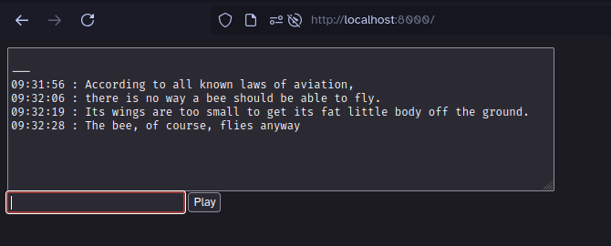

# Local TTS

A dockerised self-hosted local application to provide <abbr title="Text To Speech">TTS</abbr> functionality



## Usage

```bash
docker compose up -d
open http://localhost:8000
```

## Configuration

The main thing you might want to change is the voice. This is specified by setting the MODEL_DOWNLOAD_LINK in docker-compose.yml and requires a direct link to a .onnx file.

Get more voices from https://brycebeattie.com/files/tts/

## Known issues

The voice gets downloaded every time you start the piper container, and this can take a while because voices are large. This is tracked [upstream](https://github.com/artibex/piper-http/issues/5). If the application doesn't immediately work then wait a bit longer for the download to complete, this will be logged by the piper container.

## Uses

- [piper](https://github.com/rhasspy/piper) for the text to speech
- [piper-http](https://github.com/artibex/piper-http) to provide an API for piper
- [caddy](https://caddyserver.com/) to serve the frontend
- [docker](https://www.docker.com/) to run all of this locally

## Why

Because using a cloud API for text to speech allows them to [break your voice](https://www.youtube.com/watch?v=LKcT-aQuIFs)

Because everything else using Piper is designed to be integrated into other applications rather than run as a standalone application
